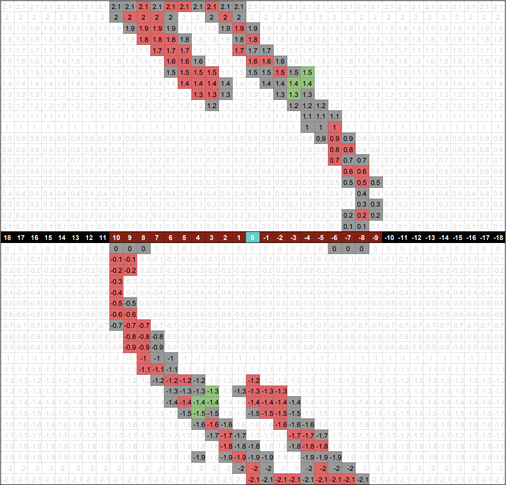

## Video

<iframe width="560" height="315" src="https://www.youtube.com/embed/7WSidibcp2E?rel=0&amp;showinfo=0" frameborder="0" allow="accelerometer; autoplay; encrypted-media; gyroscope; picture-in-picture" allowfullscreen></iframe>

---

## Project Summary
CrossyCart is an Minecraft adaptation of the games Crossy Road™ and Frogger™.

In this version, the player must get on minecarts and get off of them at the right time in order to safely cross the tracks. Minecarts move back and forth along a 20 block minecart track with randomized safe drop-off points. If the player gets off at the wrong time they will be engulfed by flames and die.

<strong>Figure 1: Example of Gameplay</strong>

The player’s current position and velocity in the minecart are factors to consider when determining when to get off. Since the player in the minecart will always be moving even when it decides to get off the minecart, it should decide to get off a couple blocks away from the goal because by the time their action is executed their position would have changed (hopefully to where the safe block is).

Minecarts typically have a predefined speed of 8 m/s. In our CrossyCart game, however, minecart speeds are variable throughout the track since minecarts collide at both ends of the 20 block track in order to move back and forth. The collision briefly brings the minecart to a stop before accelerating it again which makes it more difficult to determine the right time to get off the minecart. Getting off 3 blocks away at a velocity of 1.5, for example, may land the player on the goal block, but if the velocity is 0.6 the block distance may be less. Because of this variability, it is necessary to use machine learning algorithms to create an AI that can reliably complete the track.

---

## Approaches

In our previous report we created an AI that was able to eventually complete 1 track with a predetermined goal block which served as our baseline. Since then, we have randomized the position of the goal block and changed our states and rewards in order to create an AI that is able to complete multiple tracks with different goal blocks.

Our AI automatically gets into position to get on the minecart and gets on the minecart. The main problem lies in when it decides to get off of the minecart. We chose to use q-tabular reinforcement learning because there is a moderate number of states with only two actions to choose from: get off (crouch) or nothing. Since q-learning is model free, we are also able to see the agent learn to complete the track and handle stochastic transitions (ex. changes in speed while riding). The disadvantages of a q-tabular approach will be discussed at the end.

**Track Set-up**

After running the program, the user is prompted to enter a number of tracks that the agent will have to cross. This inputted number is used to create n number of 20-block tracks each with its own randomized goal block. The x-coordinate of the randomized goal blocks for each track is stored in an array to create our states later.

**Q-Tabular Learning**

<u>States:</u>

Our states are stored as a tuple of (distance_from_goal, current_velocity).

&nbsp;&nbsp; distance_from_goal
* The distance_from_goal only focuses on the x-coordinate difference (left ↔ right) because that is the only factor that plays into when the agent should get off the minecart. Movement in Minecraft is continuous, not block-by-block, so x-position values provided by Malmo are float values. Obviously, using this would create too many states for our q-table, so we rounded states to the nearest integer value:

* Distance is negative if it is on the right side of the goal (from the agent's perspective) and positive if it is on the left. Using the agent's current position, we calculated this by doing:

&nbsp;&nbsp; current_velocity
* Like the x-coordinate values, the velocity of the minecart also varied by many decimal places. In order to reduce the number of states we rounded again, this time to the nearest tenth decimal place. 

<u>Rewards:</u>

* **+10**: landed on goal block
* **-10**: landed on fire
* **-1**: landed on fire when previously landing on either goal or fire from this state (q-value not 0)

<u>choose_action function</u>

<strong>Pseudo-code of choose_action</strong>

The q-table values are used in the function “choose_action” in order to select which action the agent should perform.
* If the q-value is >= 10, that means calling “crouch” at that state has worked previously, so the agent knows that if it crouches at this state it will land on the goal block.
* If the q-value is between 1 and 9, that means there was a previous success at this state, but also failure(s). This could be caused by lag that causes our agent's action to execute late (when it enters another state) which can happen since the agent is constantly moving at high speeds. Our program has a 75% chance to try again, with a -15% penalty per additional failure. For example, if there is a new failure at that position, the chance of choosing "crouch" at that state would drop from 75 to 60%.
* If the q-value is 0, the agent checks if the solution has already been found. If it has not, then the agent will "crouch" in order to test the current state
* If the q-value is < 0, that means that there was a previous failure at this state. We use a epsilon-greedy policy of 0.04 to determine whether or not the agent should call “crouch” and retry this state, or do “nothing” and let the block pass. This epsilon value drops 2% per additional failure. Keep in mind that since our agent movement is continuous but our states have rounded position coordinates these small percentages happen more often than it may seem.

The advantage of approaching our choose_action function in this way is that all of the percentage chances of retrying states account for mistakes caused by system lag (which increases when trying to run and screen record). The disadvantage is that it takes longer for the mission to converge since retrying leads to repeating failures. 

---

## Evaluation

Pictured below is a table which shows an example of the agent on a track and how the q-table would get updated based on which block it gets off at. 

<strong>Figure 2: Example of Rewards</strong>

  

* Green = goal block
* Red = fire block (agent hasn’t tried block yet)
* Orange = fire block (agent previously tried this block)
* A = agent

Our program is able to successfully find a path for the agent across multiple tracks. As previously stated, our baseline for success was testing whether the agent could make it across one track. 

<strong>Figure 3: Examples of unsuccessful (left) and successful (right) gameplay</strong>

 &nbsp;&nbsp;&nbsp;&nbsp;&nbsp;&nbsp; 

The example on the left shows the agent failing to solve the problem while the example on the right shows how it learned and solved the problem. 

After successfully solving the baseline, we moved on to testing our program with multiple tracks. The graphs below show the q-table data from running the program on 2, 3, and 4 tracks.

<strong>Figure 4: Data From Successful Runs Across 2 Tracks (left), 3 Tracks (middle), and 4 Tracks (right) </strong>

 &nbsp;&nbsp;  &nbsp;&nbsp; 

In the graph above, the numbered black and brown blocks represent the distance from the goal block. The grey, red, and green blocks represent the different velocities at those distance blocks. The brown blocks indicate the range of the possible distance_from_goal blocks in those specific mission runs. Since goal blocks are randomized, the possible distance_from_goal states differ in each mission. For example, if the goal block is at the far left, then the track would have less positive distance_from_goal states and more negative distance_from_goal states. 

The similar curves shown on each graph show where the agent comes to a stop and accelerate when hitting either end of the 20-block track. As you can see, the successful states are all around the same distance and velocity away from the goal block. The data remains relatively the same no matter where the goal block is or how many tracks there are. This pattern present in all 3 graphs above shows that the agent can eventually solve any number of tracks. 

<strong>Figure 5: Example of Successful Gameplay Across 3 Tracks</strong>

 

While building upon our prototype build we did have to make some changes to get our final version. For our prototype build we only used the agent's current rounded x-position for our states. In our final version we realized we needed to make changes in order to be able to cross multiple tracks. By using the distance away from the goal block and velocities as states our agent is able to apply what it learned from successfully crossing the first track onto crossing subsequent tracks. After making these changes we recognized the disadvantages of using q-learning for this problem since many things had to be rounded in order to efficiently use a q-table.

---

## References

* assignment 2
* https://github.com/microsoft/malmo/blob/master/Malmo/samples/Python_examples/cart_test.py
