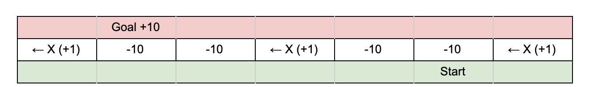

## {{ page.title }}

### Summary of the Project 
The goal of our project is to have the agent successfully cross the road by riding minecarts and getting off at its destinations. The agent’s vision will be confined to a width of 24 blocks since minecarts move at 8 m/s which is 8 blocks/sec.  If the agent moves forward without getting on a minecart (touches the track) or misses its destination, then it “dies”. The agent can only move forward. 

### AI/ML Algorithms
We will be using reinforcement learning with tabular Q-learning. 

### Evaluation Plan
Our game state is the surrent position of the agent and position of the carts on the track directly in front of the agent. The only action the agent can perform is moving forward. Some examples of metrics we will be using are +10 if the agent successfully reaches a safe zone, +1 if the agent can get on the minecart, -10 if it dies (the agent does not get off or does not get on the minecart), and -1 for missing a minecart and waiting for the next one. 

Our baseline for success is if the agent can get on and off the minecart without dying, and our baseline for failure is if the agent doesn’t get off the minecart or gets on the tracks. We expect our AI to eventually be able to get on the first available minecart at each track in order to minimize course completion time.

We will verify that the AI works based on whether it can determine if there is a minecart in front of it before moving forward and get off at its destination. Our moonshot case is if the agent can successfully cross all of the tracks without dying in minimal time, meaning it gets on the first minecart that it can at every track.

### Appointment with the Instructor 
Wednesday, April 24, 3:00pm
