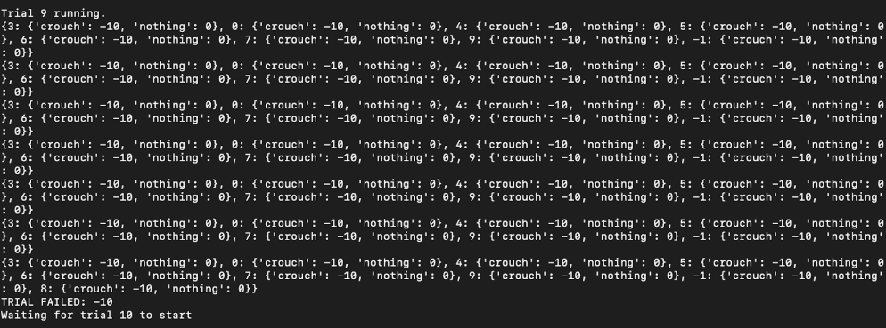
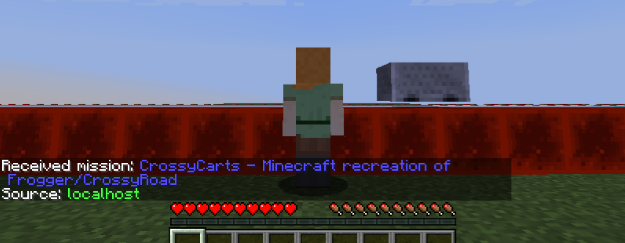
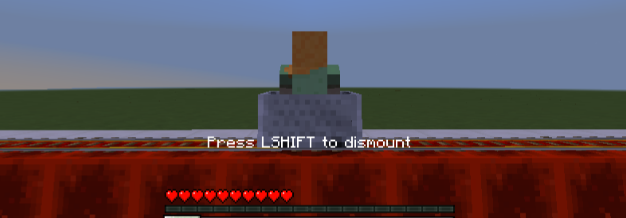
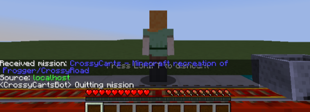

## {{ page.title }}

<iframe width="560" height="315" src="https://www.youtube.com/embed/my8mlsEsDHk?rel=0&amp;showinfo=0" frameborder="0" allow="accelerometer; autoplay; encrypted-media; gyroscope; picture-in-picture" allowfullscreen></iframe>

### Project Summary
CrossyCarts is a Minecraft AI agent that plays a modified version of Crossy Road by Hipster Whale (or Frogger by Konami). In our version, minecarts move back and forth on a 20 block track. The agent, CrossyCartsBot, has 3 actions to choose from at any state of the game: crouch, use, or nothing. When trying to get on a minecart, the agent should “use”. When trying to get off at the goal block, if it gets off (crouch) at the wrong spot or chooses the wrong action it dies. Eventually, the AI learns the best possible action to take at any given point and can successfully cross the road by getting on and off minecarts at the right time.

### Approach
The main function being used is run, which takes the agent host and current state as parameters. When run is called, it keeps choosing actions and updating the q-table until the agent reaches the goal block. The q-table is updated based on the action chosen by the agent. There are 20 different states, which depend on the location of the agent. In addition, there are two different actions to choose from, ‘crouch’ and ‘nothing’. If ‘nothing is chosen, the update looks like: q_table[curr_state][action] = 0, otherwise if ‘crouch’ is chosen, q_table[curr_state][action] is updated based on whether or not the agent got off at the goal block or not.

Some other important functions that are called while running the program are act, which takes the agent host, current state, and action as parameters. It performs the action and updates the q-table based on whether the action is ‘crouch’ or ‘nothing’. The function get_observation returns the observations of the floor ahead, floor under, or entities. Get_current_x_state and get_current_z_state return the state of the agent in the x and z directions. Finally, choose_action, returns the action the agent should choose from a list of possible actions and is implemented using an epsilon-greedy policy. 

### Evaluation
# Quantitative Evaluation:
The q-table is updated based on the action which is performed. If the agent chooses to do ‘nothing’, then the the q-table is updated with the value 0. If the agent chooses to ‘crouch’, the q-table is updated based on if the agent gets off at the goal block or not. If the agent does successfully dismount at the goal block, then the q-table is updated with the value +10. Otherwise, the q-table is updated with the value -10. 

Example of q-table during a trial:

# Qualitative Evaluation:
In our proposal, we stated that our baseline for success was if the agent could successfully mount and dismount the minecart, which it is able to do. In addition, the AI is able to determine the goal block and dismount at that location after around 14 trials. 

Example Run:

The agent before it gets on the cart. It calls ‘use’ to ride the cart. 

The agent while it is riding the minecart. It calls run to determine where to dismount the cart. 

The agent after dismounting the cart. 

### Remaining Goals and Challenges
Our current implementation is confined to one track with a set goal block. It also only creates states depending on the x position it is currently on. Ideally, we want our AI to be able to complete missions that have several more tracks and randomized goal blocks. In order to achieve this, we would have to create additional states depending on the velocity of the cart. This would involve modifying the way we store states in the q-table so that stored values are not specific to predetermined goal blocks.  

### Resources Used
We used homework assignment 2 to help us with the reinforcement learning with tabular Q-learning used in our project. 
