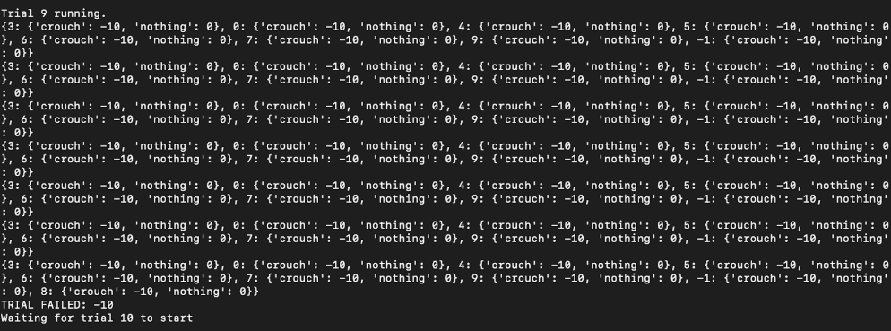
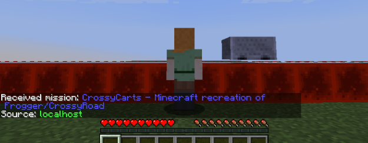
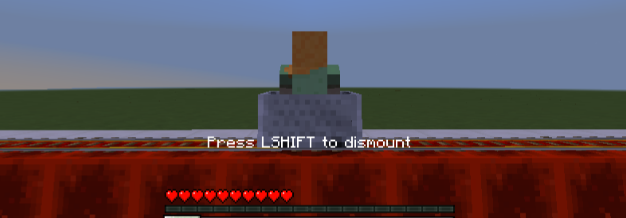
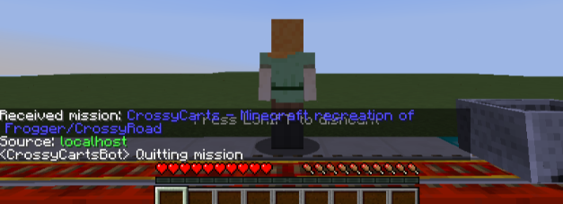
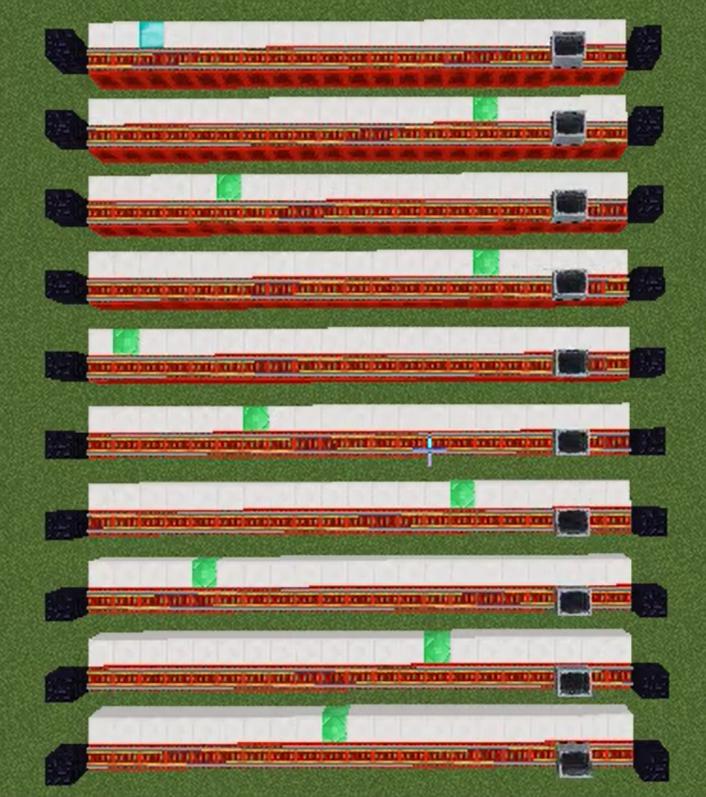

## {{ page.title }}

<iframe width="560" height="315" src="https://www.youtube.com/embed/my8mlsEsDHk?rel=0&amp;showinfo=0" frameborder="0" allow="accelerometer; autoplay; encrypted-media; gyroscope; picture-in-picture" allowfullscreen></iframe>

### Project Summary
CrossyCarts is a Minecraft AI agent that plays a modified version of CrossyRoad by Hipster Whale (or Frogger by Konami). In our version, minecarts move back and forth on a 20 block track. The agent, CrossyCartsBot, has 3 actions to choose from: crouch, use, or nothing. When trying to get on a minecart, the agent should “use”. When trying to get off at the goal block, if it gets off (crouch) at the wrong spot or chooses the wrong action it dies. Eventually, the AI learns the best possible action to take at any given point and can successfully cross the road by getting on and off minecarts at the right time.

### Approach
Our program uses tabular Q-learning to determine the best action to perform at every game state. The q-table is updated based on the action chosen by the agent. For our prototype, there are 20 different states which depend on the x-position of the agent in each block of the track. In addition, there are two actions to choose from: ‘crouch’ or ‘nothing’. If ‘nothing’ is chosen, the update looks like: q_table[curr_state][action] = 0, otherwise if ‘crouch’ is chosen, q_table[curr_state][action] is updated based on whether or not the agent got off at the goal block or not (+10 if goal block, -10 if not). Our program runs several trials, choosing actions and updating the q-table until the agent reaches the goal block.

The 20 states we created for our q-table does not reflect the actual amount of states in the game since movement is continuous. For example, the agent may actually be at x-position 1.258 when it is performing for state 1. Because of this, the q-table may sometimes mark a state with crouch: -10 incorrectly. For example, getting off while at x-position 1.258 may not land on the goal block, but getting off at x-position 1.498 does. To take care of these cases, our choose_action function is implemented using an epsilon-greedy policy so that the AI has a chance to retry getting off at states near the goal block. 

### Evaluation
**Quantitative Evaluation:**
The q-table is updated based on the action which is performed. If the agent chooses to do ‘nothing’, then the the q-table is updated with the value 0. If the agent chooses to ‘crouch’, the q-table is updated based on if the agent gets off at the goal block or not. If the agent does successfully dismount at the goal block, then the q-table is updated with the value +10. Otherwise, the q-table is updated with the value -10. 

Example of q-table during a trial:

**Qualitative Evaluation:**
In our proposal, we stated that our baseline for success was if the agent could successfully mount and dismount the minecart, which it is able to do. In addition, the AI is able to determine the goal block and dismount at that location after about 14 trials. 

Example Run:

The agent before it gets on the cart. It calls ‘use’ to ride the cart. 

The agent while it is riding the minecart. It calls run to determine where to dismount the cart. 

The agent after dismounting the cart. 

### Remaining Goals and Challenges
Our current implementation is confined to one track with a set goal block. It also only creates states depending on the x-position of the block it is currently on. Ideally, we want our AI to be able to complete missions that have several more tracks and randomized goal blocks. In order to achieve this, we would have to create additional states depending on the velocity of the cart which would mean there would be 40 states for each track instead of 20. We would also need to change the way we store states in the q-table so that stored values are not specific to predetermined goal blocks.

We also aim to visually show that the agent dies when it performs the wrong action instead of simply starting a new trial. The most challenging part of the project so far has been understanding how to use Malmo to get information and perform necessary actions. We had a lot of problems with reliably getting entity information, so we anticipate that the greatest challenge will be figuring out exactly how to implement these changes.

Example future mission:

### Resources Used
We used homework assignment 2 to help us with the reinforcement learning with tabular Q-learning used in our project. 
